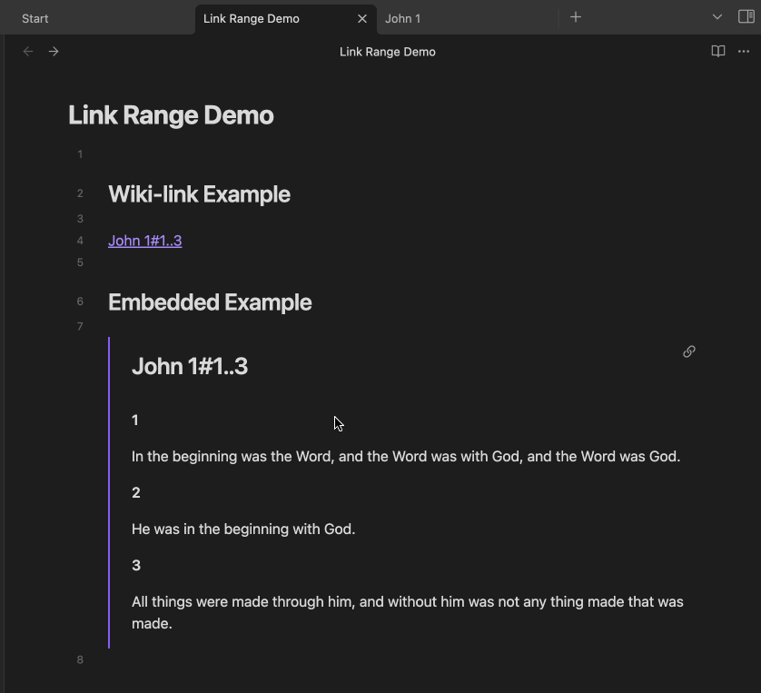
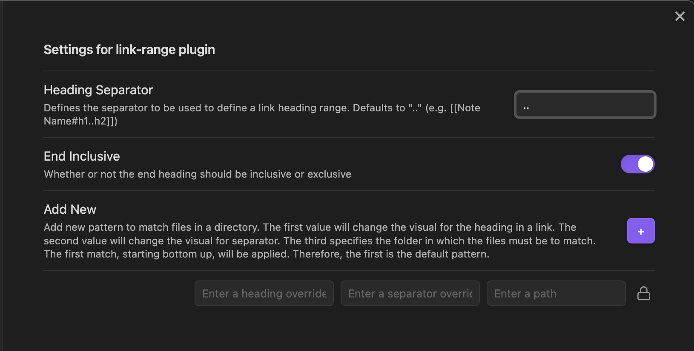
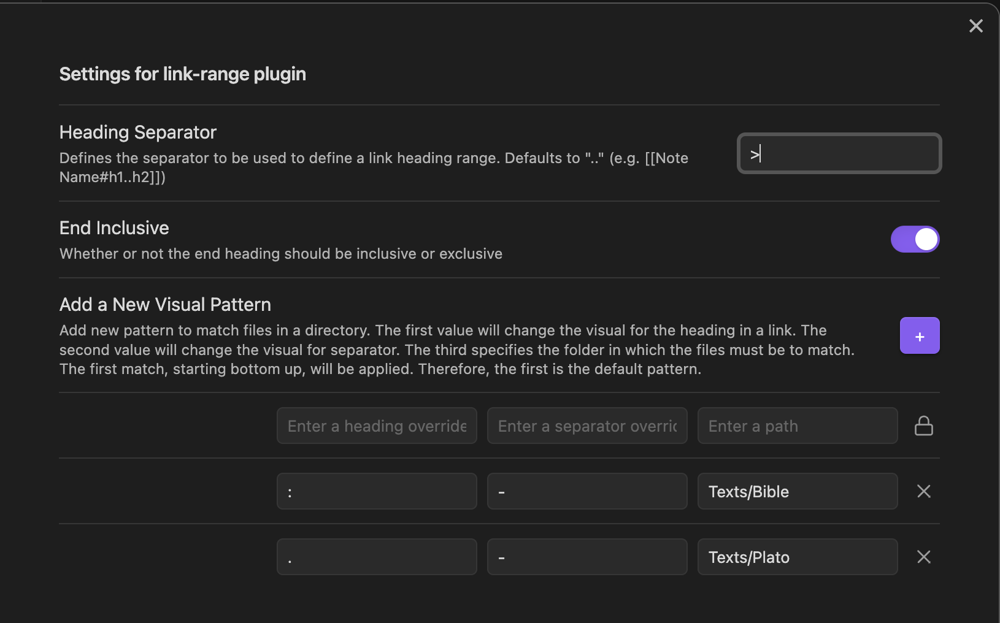

# Obsidian Link Range

This plugin brings wiki-link header range queries to Obsidian while retaining native backlink functionality. Supports standard wiki-links or other user-defined patterns, hover preview, and embedded content wiki-links.

## Usage
To use, simply use the same wiki-link syntax you're used to in obsidian, but instead of specifying a single header, you can specify a header range separated by a separator string.

For example, if I wanted a link to headers "Ingredients" through "Directions" in a note named "Recipe", I could craft a link like the following:

`[[Recipe#Ingredients..Directions]]`

## Basic Settings

The default settings give you the functionality indicated above.

## Advanced Settings Choices

If you prefer a different heading separator than the Wikilink syntax, you may change it.

Some will want to change the visual style of the heading separators. The 

