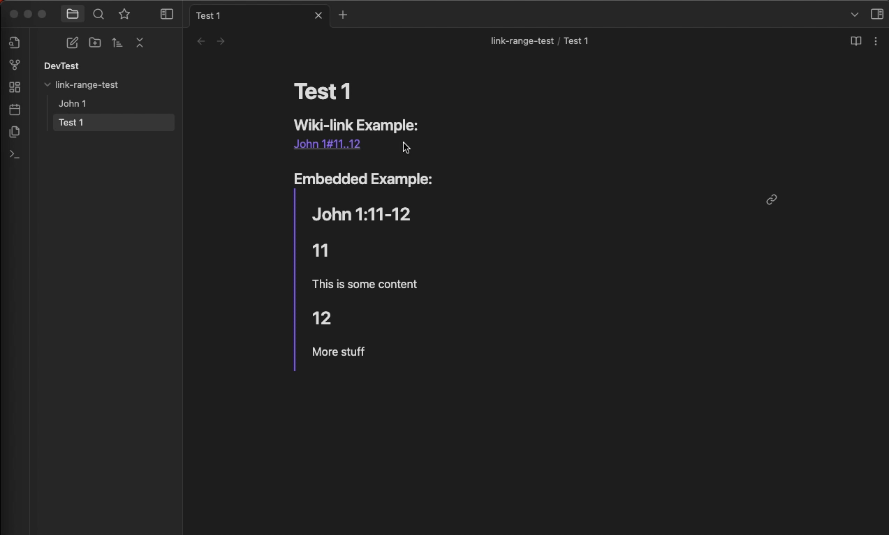

# Obsidian Link Range

This plugin brings wiki-link header range queries to Obsidian while retaining native backlink functionality. Supports standard wiki-links, hover preview, and embedded content wiki-links.

## Usage
To use, simply use the same wiki-link syntax you're used to in obsidian, but instead of specifying a single header, you can specify a header range separated by a separator string.

For example, if I wanted a link to headers "Ingredients" through "Directions" in a note named "Recipe", I could craft a link like the following:

`[[Recipe#Ingredients..Directions]]`

## Settings
| Setting           | Description  | Default Value | 
| ------------------------------------------- | ------ | ------ |
| Heading Separator   | Defines the separator to be used to define a link heading range. I.e. this is the ".." in example: `[[Note 1#h1..h2]]`   | `..`     |
| Alt Text Format | The alternate text format that gest shown when in read mode. Use $note for the note name placeholder, and $h1/$h2 for the header placeholders. | `$note:$h1-$h2` |
| End Inclusive    | When turned on, the second header and the content following it (through the next header in the note) is shown.   | true   |
